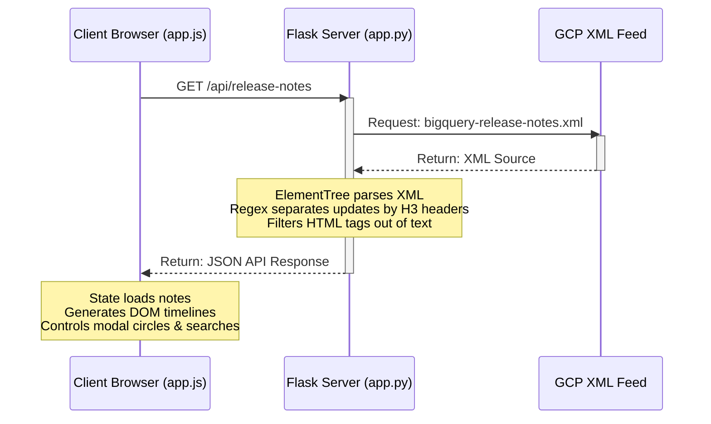

# 🚀 BigQuery Release Notes Tracker & X (Twitter) Sharing App

A premium, highly polished web application built with **Python Flask** and **Vanilla HTML, CSS, and JavaScript** that aggregates the official Google Cloud BigQuery Release Notes, structures them into an interactive timeline, and enables users to instantly format, copy, and share updates to **X (formerly Twitter)** with a built-in X post composer preview.

---

## ✨ Key Features

- **🔄 Proxy Feed Fetching**: Fetches and parses the official BigQuery Release Notes XML feed dynamically on the server side to prevent CORS issues.
- **🎨 Glassmorphic Dark-Mode UI**: A modern interface featuring glowing category tags, CSS timeline transitions, responsive layout grids, and interactive widgets.
- **🏷️ Smart Update Categorization**: Automatically groups and badges release items based on their type:
  - <span style="color: #c084fc; font-weight: bold;">Feature</span> (`🚀`) - New options, configurations, and tools.
  - <span style="color: #34d399; font-weight: bold;">Fix</span> (`🛠️`) - Resolutions for bugs and errors.
  - <span style="color: #fbbf24; font-weight: bold;">Issue</span> (`⚠️`) - Known limitations and service disruptions.
  - <span style="color: #f87171; font-weight: bold;">Deprecation</span> (`🚫`) - Phasing out of legacy capabilities.
  - <span style="color: #9ca3af; font-weight: bold;">General</span> (`📢`) - Miscellaneous notices and documentation changes.
- **🔍 Real-Time Filter & Search**: Search across dates, titles, and descriptions, or filter by category pills instantly.
- **🐦 Native-Style X Composer Modal**:
  - Pre-fills a beautifully formatted tweet with the correct emoji, category, brief snippet, and official Google Cloud documentation link.
  - Integrates a custom **circular character progress ring** tracking the 280-character limit (colors shift from Twitter Blue $\rightarrow$ Amber Warning $\rightarrow$ Red Limit).
- **📋 Clipboard Copy Actions**: Formats release details into markdown and copies to the clipboard with clean success toast popups.

---

## 🛠️ Tech Stack

- **Backend**: Python 3.10+, Flask
- **Frontend**: Vanilla HTML5, CSS3, Modern ES6+ JavaScript
- **Icons**: FontAwesome 6 (free CDN integration)
- **Typography**: Google Fonts (Inter & Outfit)

---

## 📂 Project Directory Structure

```text
bigquery-notes/
├── app.py                  # Flask main backend server (RSS parser & API generator)
├── templates/
│   └── index.html          # Main HTML structure & sharing modal UI
├── static/
│   ├── css/
│   │   └── style.css       # Core design systems, glassmorphism tokens, and keyframe animations
│   └── js/
│       └── app.js          # State controller, search algorithms, modal actions, and character limits
├── .gitignore              # Configured paths to ignore under version control
└── README.md               # Detailed project documentation and setup instructions
```

---

## 🏗️ How it Works



---

## 🚀 Getting Started

Follow these instructions to set up the repository locally.

### 1. Clone the Repository
```bash
git clone https://github.com/vutienne/vutienne-event-talks-app.git
cd vutienne-event-talks-app
```

### 2. Set Up a Virtual Environment (Optional but Recommended)
**On Windows:**
```powershell
python -m venv venv
.\venv\Scripts\Activate.ps1
```

**On macOS/Linux:**
```bash
python3 -m venv venv
source venv/bin/activate
```

### 3. Install Flask Dependency
```bash
pip install flask
```

### 4. Run the Server
```bash
python app.py
```

The server will initialize on:
👉 **[http://127.0.0.1:5000](http://127.0.0.1:5000)**

---

## 🔌 API Documentation

### Get Compiled Release Notes
Returns chronological entries with their sub-categorized update items.

* **Endpoint**: `/api/release-notes`
* **Method**: `GET`
* **Response Format**: `application/json`
* **Success Schema (200 OK)**:
  ```json
  {
    "success": true,
    "entries": [
      {
        "id": "tag:google.com,2010:cloud-release-note:...",
        "link": "https://cloud.google.com/bigquery/docs/release-notes#June_15_2026",
        "title": "June 15, 2026",
        "updated": "2026-06-15T10:00:00Z",
        "items": [
          {
            "type": "Feature",
            "html_content": "<p>You can now use Gemini Cloud Assist to analyze SQL...</p>",
            "text_content": "You can now use Gemini Cloud Assist to analyze SQL..."
          }
        ]
      }
    ]
  }
  ```

---

## 📄 License

Distributed under the MIT License. See [LICENSE](https://github.com/vutienne/vutienne-event-talks-app) for more information.
